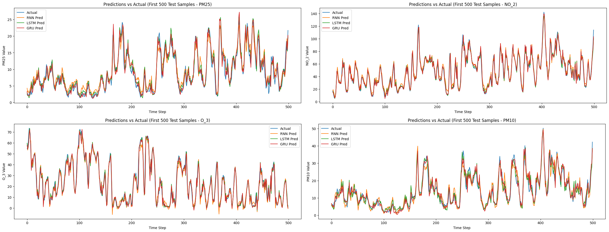
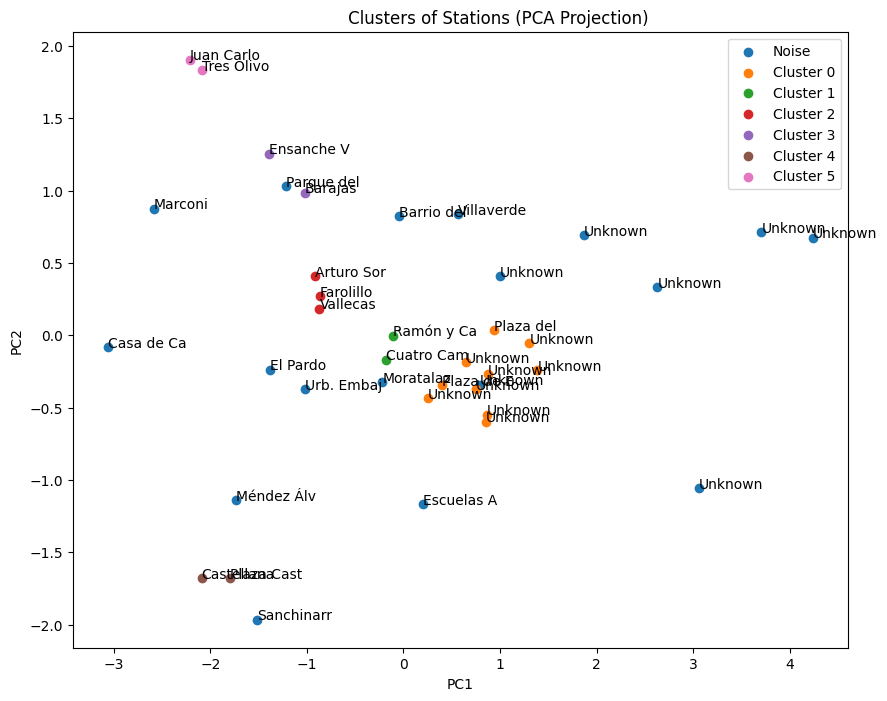

# Madrid Air Quality Forecasting

## Project Overview
This project is an implementation for time series forecasting of air quality in Madrid, based on the Kaggle dataset "Air Quality in Madrid (2001-2018)". The project uses PyTorch to build and compare deep learning models (LSTM, RNN, GRU) for predicting pollutants like NO₂, O₃, PM10, and PM2.5. 

Key objectives:
- Preprocess hourly pollutant data (aggregation, imputation, normalization).
- Train models on data from 2001-2017 and test on 2018.
- Evaluate performance using metrics like MSE, MAE, and visualizations.

There is an investigation and study between the efficacy of LSTM, RNN, and GRU models, including comparative training losses, prediction accuracy, and runtime efficiency.

Additionally, two extensions are included to study the efficacy of LSTM:
- **Extra Feature 1**: Temporal pattern analysis (e.g., seasonal decomposition).
- **Extra Feature 2**: Spatial clustering of monitoring stations using KMeans and DBSCAN to reveal pollution profiles (e.g., urban vs. suburban differences).

## Requirements
- Python 3.8+
- PyTorch 2.0+
- Libraries: `numpy`, `pandas`, `scikit-learn`, `matplotlib`, `torch`

## Setup Instructions
1. Download the dataset from Kaggle and unzip `archive.zip` into the root folder.
2. Run the Jupyter Notebook. Model weights are saved as `.pth` files after training.

## Results
- **Core Model Performance**: Best model (e.g., LSTM) achieves low MSE on test data. Comparative study shows LSTM outperforming RNN in capturing long-term dependencies, with GRU offering a balance in speed and efficiency.

- **Extra Feature 1: Temporal Patterns**: Seasonal decomposition reveals periodic trends, such as higher NO₂ in winter due to traffic and heating, and elevated O₃ in summer from photochemical reactions.

- **Extra Feature 2: Spatial Clustering**: KMeans identifies 3 clusters (high NO₂ urban/traffic, high O₃ suburban, balanced mixed/industrial). DBSCAN detects outliers like unique industrial stations, highlighting spatial differences in pollution sources (e.g., central city vs. outskirts).

## Acknowledgments
Dataset: [Kaggle - Air Quality in Madrid](https://www.kaggle.com/datasets/decide-soluciones/air-quality-madrid)
